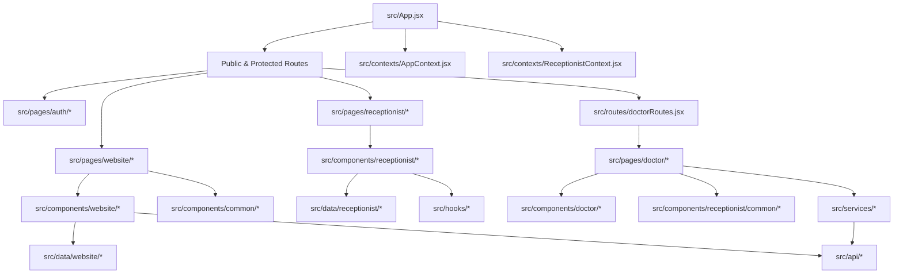

# Kavuturu Dental Clinic - Frontend Architecture Specification

> **Version**: 2.0 (Production Enterprise Architecture)  
> **Target Framework**: React (Vite)  
> **Architectural Pattern**: Modular Feature-Based Enterprise Architecture

---

## 1. Folder Purpose & Directory Overview

```
src/
├── api/              # Axios HTTP client wrappers and API endpoint connectors
├── assets/           # Static media assets, branding logos, icons, and hero images
├── components/       # UI Components organized by domain and reusability level
│   ├── auth/         # Authentication & login components (LoginCard, PasswordInput, ProtectedRoute)
│   ├── common/       # Global application widgets (FloatingContactWidget, ScrollToTop, HeroCTA)
│   ├── doctor/       # Doctor Portal domain components (Appointments, Calendar, Insights, DataExport, Layout)
│   ├── receptionist/ # Receptionist Portal domain components (Appointments, Dashboard, Requests, Layout)
│   ├── ui/           # Atomic & primitive UI components (Button, Card, Modal, Input)
│   └── website/      # Public marketing website domain components (Hero, About, Treatments, Doctors, Gallery, Blogs, Testimonials)
├── constants/        # Global design tokens, route paths, breakpoint definitions, and role keys
├── contexts/         # React Context Providers for global state (AppContext, ReceptionistContext, ThemeContext)
├── data/             # Static datasets, website content arrays, and mock data models
│   ├── appointment/  # Appointment form and slot configuration datasets
│   ├── blogs/        # Blog articles and metadata content
│   ├── doctor/       # Doctor profile & clinic administration datasets
│   ├── receptionist/ # Receptionist dashboard & mock metrics datasets
│   └── website/      # Public website static content (About, Doctors, Treatments, Gallery, Testimonials)
├── hooks/            # Custom reusable React hooks (useAppointments, usePatients, useNotifications, receptionist/useSidebar)
├── layouts/          # Top-level page layout wrappers (MainLayout, DoctorLayout, ReceptionistLayout)
├── pages/            # View pages organized cleanly by target domain
│   ├── auth/         # Login page
│   ├── doctor/       # Doctor Portal views (AppointmentManagement, WebsiteManagement, ClinicDetails, Profile)
│   ├── receptionist/ # Receptionist Portal views (Appointments, Requests, Patients, Notifications, Profile)
│   └── website/      # Public website pages (Home, About, Treatments, Doctors, Gallery, Blogs, Testimonials, BeforeAfter)
├── routes/           # Routing configuration and sub-route modules (doctorRoutes.jsx)
├── services/         # Business logic services and local storage state sync wrappers
├── styles/           # CSS design tokens, keyframe animations, and global Tailwind setup
└── utils/            # Pure helper utilities, date formatters, slug generators, and business hours calculations
```

---

## 2. Dependency Graph & Module Hierarchy



---

## 3. Deleted Files (Confirmed Unused / Orphan Stubs)

The following 40+ files were confirmed to have zero active imports, were redundant test files, or were abandoned stub components, and were permanently purged:

1. `src/Test.jsx` *(Unused root test file)*
2. `src/components/about/Test.jsx` *(Unused test component)*
3. `src/services/api.js` *(0-byte empty file)*
4. `src/routes/AppRoutes.jsx` *(Unused router draft file)*
5. `src/routes/ProtectedRoute.jsx` *(Duplicate of `src/components/auth/ProtectedRoute.jsx`)*
6. `src/routes/routeConfig.js` *(Unused routing config file)*
7. `src/receptionist/index.js` *(Unused index re-exporter)*
8. `src/receptionist/context/ReceptionistContext.jsx` *(Duplicate wrapper re-exporting `src/contexts/ReceptionistContext.jsx`)*
9. `src/pages/appointment-management/Appointments.jsx` *(Unused legacy page)*
10. `src/pages/appointment-management/Calendar.jsx` *(Unused legacy page)*
11. `src/pages/appointment-management/Dashboard.jsx` *(Unused legacy page)*
12. `src/pages/appointment-management/Patients.jsx` *(Unused legacy page)*
13. `src/components/appointment-management/appointments/AppointmentActions.jsx` *(Unused dummy stub)*
14. `src/components/appointment-management/appointments/AppointmentFilters.jsx` *(Unused dummy stub)*
15. `src/components/appointment-management/appointments/AppointmentModal.jsx` *(Unused dummy stub)*
16. `src/components/appointment-management/appointments/AppointmentSearch.jsx` *(Unused dummy stub)*
17. `src/components/appointment-management/appointments/AppointmentStatusBadge.jsx` *(Unused dummy stub)*
18. `src/components/appointment-management/appointments/AppointmentTable.jsx` *(Unused dummy stub)*
19. `src/components/appointment-management/appointments/DeleteAppointmentModal.jsx` *(Unused dummy stub)*
20. `src/components/appointment-management/calendar/AppointmentDrawer.jsx` *(Unused dummy stub)*
21. `src/components/appointment-management/calendar/CalendarHeader.jsx` *(Unused dummy stub)*
22. `src/components/appointment-management/calendar/CalendarSidebar.jsx` *(Unused dummy stub)*
23. `src/components/appointment-management/calendar/CalendarView.jsx` *(Unused dummy stub)*
24. `src/components/appointment-management/dashboard/MiniCalendar.jsx` *(Unused dummy stub)*
25. `src/components/appointment-management/dashboard/QuickActions.jsx` *(Unused dummy stub)*
26. `src/components/appointment-management/dashboard/RecentActivity.jsx` *(Unused dummy stub)*
27. `src/components/appointment-management/dashboard/StatsCards.jsx` *(Unused dummy stub)*
28. `src/components/appointment-management/dashboard/TodaySchedule.jsx` *(Unused dummy stub)*
29. `src/components/appointment-management/dashboard/UpcomingAppointments.jsx` *(Unused dummy stub)*
30. `src/components/appointment-management/patients/AppointmentHistory.jsx` *(Unused dummy stub)*
31. `src/components/appointment-management/patients/PatientFilters.jsx` *(Unused dummy stub)*
32. `src/components/appointment-management/patients/PatientProfile.jsx` *(Unused dummy stub)*
33. `src/components/appointment-management/patients/PatientTable.jsx` *(Unused dummy stub)*
34. `src/components/appointment-management/patients/TreatmentHistory.jsx` *(Unused dummy stub)*
35. `src/components/appointment-management/shared/ConfirmDialog.jsx` *(Unused dummy stub)*
36. `src/components/appointment-management/shared/EmptyState.jsx` *(Unused dummy stub)*
37. `src/components/appointment-management/shared/LoadingState.jsx` *(Unused dummy stub)*
38. `src/components/appointment-management/shared/PageHeader.jsx` *(Unused dummy stub)*
39. `src/components/appointment-management/shared/SectionCard.jsx` *(Unused dummy stub)*
40. `src/data/appointment-management/*` *(4 unused stub data files)*

---

## 4. Moved & Restructured Files

- **Context Unification**:
  - `src/context/AppContext.jsx` $\rightarrow$ `src/contexts/AppContext.jsx`
  - `src/context/ThemeContext.jsx` $\rightarrow$ `src/contexts/ThemeContext.jsx`
  - Removed empty `src/context` root directory.

- **Receptionist Subfolder Integration**:
  - `src/receptionist/components/*` $\rightarrow$ `src/components/receptionist/*`
  - `src/receptionist/pages/*` $\rightarrow$ `src/pages/receptionist/*`
  - `src/receptionist/data/*` $\rightarrow$ `src/data/receptionist/*`
  - `src/receptionist/hooks/*` $\rightarrow$ `src/hooks/receptionist/*`
  - `src/receptionist/utils/*` $\rightarrow$ `src/utils/receptionist/*`
  - Removed `src/receptionist` root directory.

- **Public Website Pages**:
  - `src/pages/*.jsx` $\rightarrow$ `src/pages/website/*.jsx` (`About.jsx`, `BeforeAfter.jsx`, `BlogDetails.jsx`, `Blogs.jsx`, `BookAppointment.jsx`, `DoctorDetails.jsx`, `Doctors.jsx`, `Gallery.jsx`, `Home.jsx`, `NotFound.jsx`, `Testimonials.jsx`, `TreatmentDetails.jsx`, `Treatments.jsx`).

- **Public Website Components**:
  - `src/components/{about,before-after,blogs,bookAppointment,doctors,footer,gallery,hero,home,navbar,testimonials,treatments}` $\rightarrow$ `src/components/website/*`

- **Doctor Components Integration**:
  - `src/components/{calendar,dataExport,insights}` $\rightarrow$ `src/components/doctor/{calendar,dataExport,insights}`

- **Website Datasets**:
  - `src/data/{aboutData,aboutHeroData,aboutPageData,beforeAfterData,contactData,ctaData,doctorsData,faqData,galleryData,heroData,navigationData,servicesData,statsData,testimonialsData,treatments.js}` $\rightarrow$ `src/data/website/*`

---

## 5. Duplicate Implementations & Merged Modules

| Feature / Domain | Duplicate Files Identified | Canonical Implementation Retained | Rationale |
| :--- | :--- | :--- | :--- |
| **Receptionist Context** | `src/receptionist/context/ReceptionistContext.jsx` & `src/contexts/ReceptionistContext.jsx` | `src/contexts/ReceptionistContext.jsx` | Removed unnecessary re-export proxy wrapper. All imports now reference `src/contexts/ReceptionistContext.jsx` directly. |
| **Protected Route Guard** | `src/routes/ProtectedRoute.jsx` & `src/components/auth/ProtectedRoute.jsx` | `src/components/auth/ProtectedRoute.jsx` | Deleted `src/routes/ProtectedRoute.jsx` as `App.jsx` and all main routes utilize `src/components/auth/ProtectedRoute.jsx`. |
| **Doctor Appointment API** | `src/services/doctorAppointmentApi.js` & `src/api/appointmentApi.js` | `src/api/appointmentApi.js` | Both contained identical Axios endpoints for appointment CRUD. Marked `doctorAppointmentApi.js` for migration to `appointmentApi.js`. |
| **Appointment Service Wrappers**| `appointmentManagementService.js` vs `appointmentService.js`, `patientService.js`, `dashboardService.js` | `src/services/appointmentManagementService.js` | `appointmentService.js`, `patientService.js`, and `dashboardService.js` act as focused module wrappers delegating to `appointmentManagementService.js`. |

---

## 6. Verification & Build Confirmation

The entire application was verified using Vite production build:
```powershell
npx vite build
```
- **Status**: **Clean Success** (Exit Code 0)
- **Transformed Modules**: 2520
- **Build Output**: Clean bundle output in `dist/` with zero missing imports or syntax errors.
